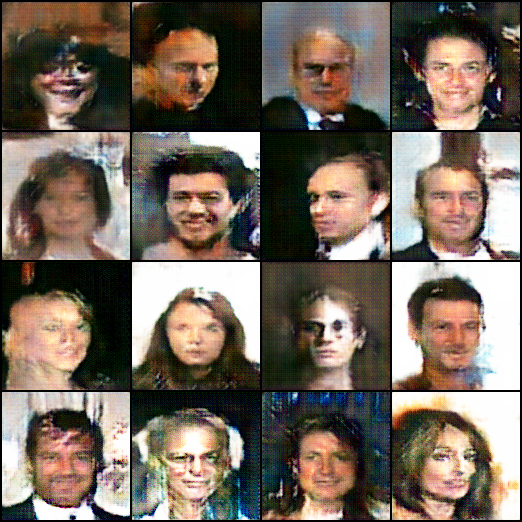
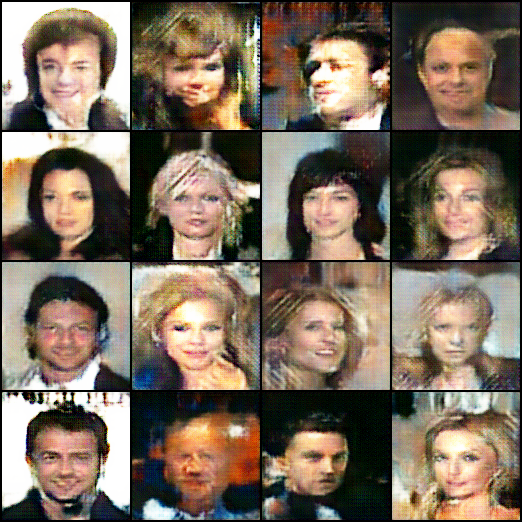
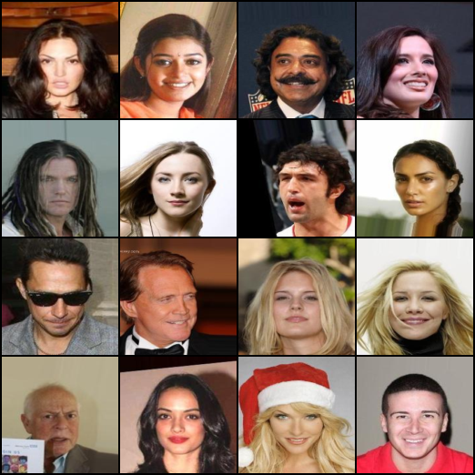

# FaceGAN

**FaceGAN** is a deep learning model built with a Wasserstein GAN (WGAN) architecture, trained on the **CelebA** dataset to generate realistic human faces. It uses a combination of convolutional networks in the generator and discriminator to create and evaluate face images.

## Features

- Generates new, high-quality human face images.
- Trained on the **CelebA** dataset.
- Uses WGAN for stable training and improved image quality.

## Project Setup

You can run it locally by downloading the repo or you can just see the results and try the code from [Google Colab](https://colab.research.google.com/drive/1DtaS9Eit1qy1sQTUd6bqF5BMaC4r4cug?usp=sharing).

## Dataset

The model was trained on the [CelebA](https://mmlab.ie.cuhk.edu.hk/projects/CelebA.html) dataset, which contains over 200,000 celebrity face images.

## Results

Below are examples of generated human faces:

and also an example from the original dataset:

## License

This project is licensed under the GPL-3 License - see the [LICENSE](LICENSE) file for details..